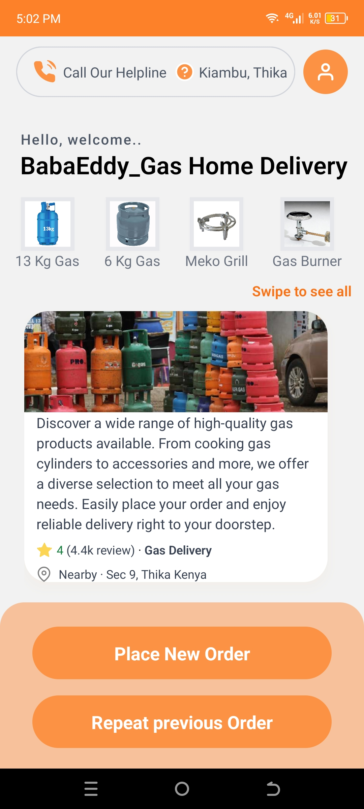
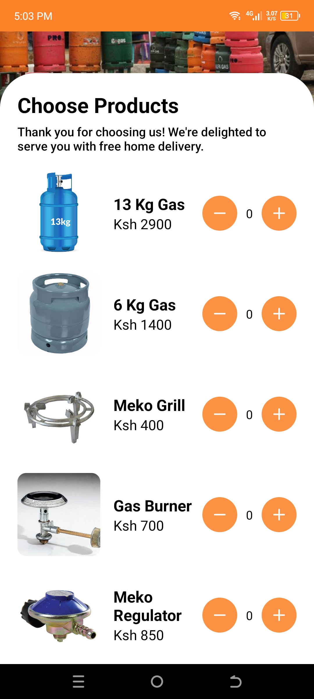

# BabaEddy Gas Home Delivery App

Welcome to BabaEddy Gas Home Delivery App! This mobile application allows users to conveniently order gas products and have them delivered straight to their doorstep. Whether you're cooking up a storm in the kitchen or need a refill for your gas appliances, BabaEddy Gas Home Delivery has you covered.

## Features

- User-friendly Interface: Easily navigate through the app with its intuitive user interface.
- Secure account management with options for registration, login, and profile setup.
- Product Selection: Choose from a wide range of high-quality gas products, including cylinders, regulators, and accessories.
- Convenient Ordering: Place orders seamlessly with just a few taps on your smartphone.

## Getting Started

Once BaBaEddygas Hub is installed, follow these steps to get started:

### Account Setup:

- Simply provide your email address and create a secure password to register.
- After registering, users can complete their profiles by providing additional information such as contact details and delivery addresses.
- Once the account setup is complete, users can log in to access the full range of features and functionalities offered by the app.

### Ordering Process:

- Start by browsing the available products listed in the app. The product catalog includes various gas cylinder sizes and related accessories.
- Select the desired products by tapping on them to view detailed information such as price, description, and availability.
- Specify the quantity of each product you wish to order and add them to your shopping cart.
- Review your order summary, including the total cost and any applicable taxes or fees

### Delivery Information:

- Once the order is placed and confirmed, you'll receive a confirmation notification with an estimated delivery time.
- Delivery is available in select areas or regions, with coverage extending to nearby neighborhoods and suburbs.
- Depending on the delivery distance and urgency, additional delivery fees or charges may apply. These will be clearly communicated during the checkout process.

## Support and Feedback:

At BabaEddy Gas Delivery, we value your feedback and are committed to providing exceptional customer support. If you have any questions, encounter any issues, or would like to share your feedback, please don't hesitate to reach out to us. Here's how you can get in touch:

### Customer Support:

For general inquiries or assistance with using the app, you can contact our customer support team directly through the app's built-in support feature.
Email Support:

Alternatively, you can reach us via email at ekaranja28@gmail.com. The support team will respond to your inquiries promptly and provide assistance with any issues or concerns you may have.

